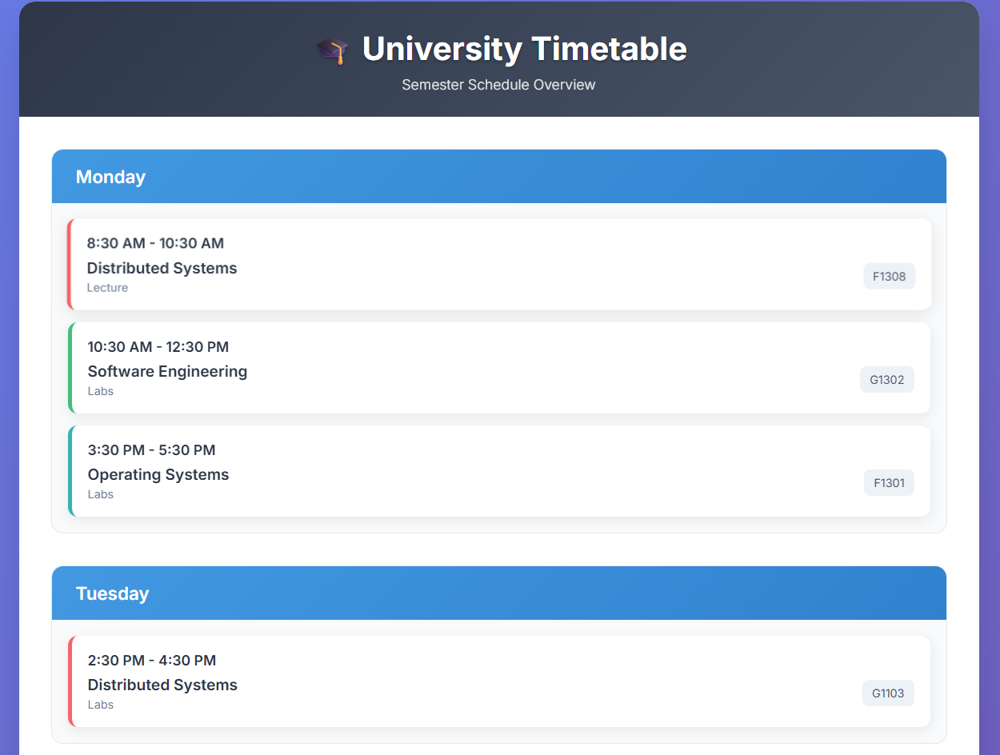
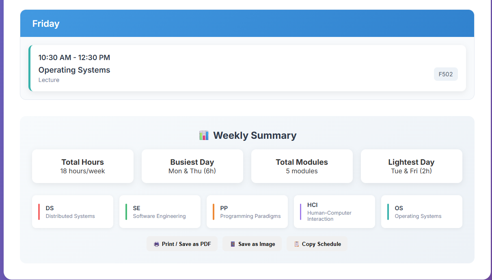

# 📚 Y2-S2 Timetable Website

A sleek, single-file website to view, interact with, and download your **Year 2 Semester 2 university timetable** as an image or PDF.

---

## ✨ Features

- **Responsive, modern UI** – Uses [Inter](https://fonts.google.com/specimen/Inter) font and attractive gradients.
- **Full week timetable** laid out by day and module.
- **Summary section** for hours, busiest days, and module legend.
- **Download as PNG** – Save the timetable as a high-quality image with one click.
- **Print/Save as PDF** – Use your browser’s print dialog for a PDF version.
- **Copy to Clipboard** – Exports a tidy text schedule for quick sharing.

---

## 🚀 How to Use

1. **Open [`doc.html`](doc.html) in your browser.**
2. Review your timetable and summary.
3. Use the buttons at the bottom or floating "Download PNG" button:
    - 🖨️ **Print / Save as PDF** – Opens print dialog for PDF export.
    - 📱 **Save as Image** – Exports the timetable as a PNG.
    - 📋 **Copy Schedule** – Copies a plain-text version of your timetable.

---

## 📷 Screenshots

Below are some screenshots of the timetable website:

### Main View

### Download & Copy Options

---

## 🛠️ Tech

- **HTML5, CSS3, JS** (single static file)
- [html2canvas](https://html2canvas.hertzen.com/) for PNG export

---

## ✍️ Credits

Created by [s-sandali](https://github.com/s-sandali)  
Icons: Unicode Emoji  
Font: [Inter](https://fonts.google.com/specimen/Inter)

---

*Feel free to fork, customize, and use for your own semester schedules!*
